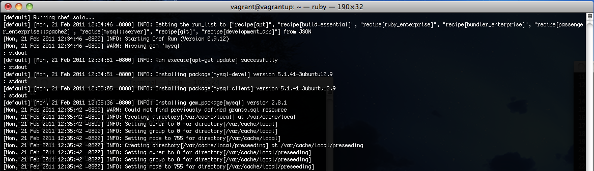
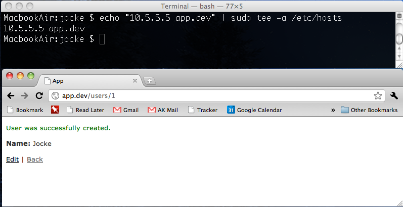

!SLIDE center First bullets transition=fade
# Vagrant #

A presentation by Joakim Kolsjö at SHRUG / Valtech, 22 feb 2011.

!SLIDE bullets transition=fade 
# Vagrant? #

* A tool for building virtualized development environments.

!SLIDE bullets transition=fade 
# Why would you use vagrant? #

* Get new computers up and running quickly. 
* Avoid bugs due to differences in development environments.
* Version your development enviornment.

!SLIDE bullets transition=fade
# Getting started #

    $ ls
    app lib log db ...

    $ gem install vagrant
    $ vagrant box add base http://...
    $ vagrant init
    $ vagrant up

    $ vagrant ssh
    vagrant@vagrantup:~$ ls /vagrant
    app lib log db ...

!SLIDE bullets transition=fade 
# Installing a development environment #

* You can install using either **Chef** or **Puppet**.
* I'm going show how to use **Chef**.

!SLIDE bullets transition=fade 
# Chef #

* A tool to install software and configure computers.
* Uses script bundles called **cookbooks**, one for each application or library.
* A **cookbook** can be configured by **json** or **ruby** to use custom paths, versions, etc.

!SLIDE transition=fade
# Configuring vagrant for chef #

    @@@ Ruby
    # Vagrantfile 
    Vagrant::Config.run do |config|
      config.vm.provision :chef_solo do |chef|
        chef.cookbooks_path = [ "cookbooks" ]
        chef.json = {
          "mysql" => {
            "server_root_password" =>  "example"
          }
        }
        chef.add_recipe "mysql"
      end
    end

!SLIDE center transition=fade
# Cooking... #

!SLIDE center transition=fade
# All done... #

!SLIDE bullets transition=fade
# User experience? #

* The filesystem is slow (okay with NFS)
* Git can be very slow (even with NFS) on big projects within the VM.

!SLIDE bullets transition=fade
# Other? #

* Test runtime within the VM is about the same as outside it.
* You can't use editor shortcuts like **mate** within a vagrant VM without some trickery.

!SLIDE transition=fade
# Questions? #

!SLIDE bullets transition=fade
# Example app #

* [http://bit.ly/vagrant_example](http://bit.ly/vagrant_example)

