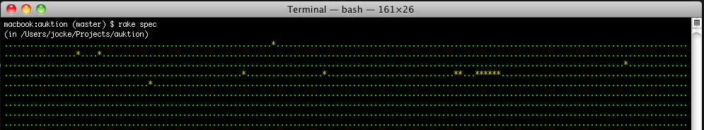
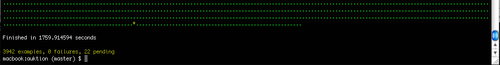
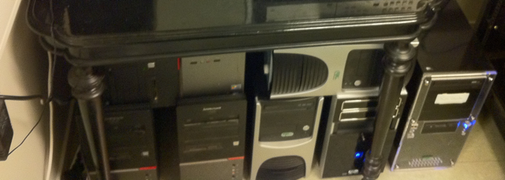
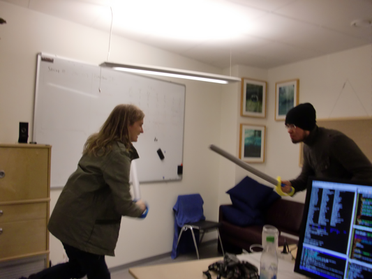
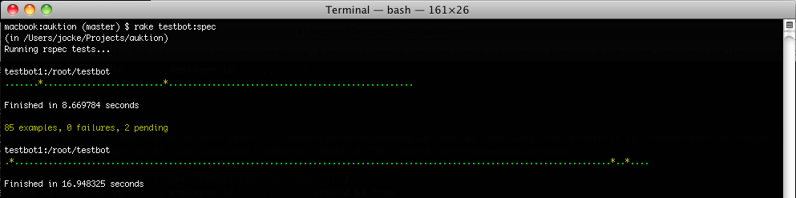
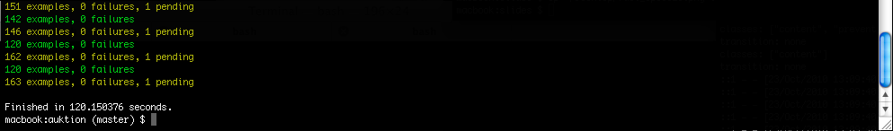

!SLIDE center First bullets transition=fade

* Side projects

!SLIDE bullets transition=fade 
# We had a problem #

* Tests that take way too long to run…
* **30** minutes!

!SLIDE center bullets transition=fade
# Introducing our "**rack**" #

* 7 x 2 cores = **14** test runners!

!SLIDE center bullets transition=fade
# And other unused resources… #

* I mean, the **development machines**! (+10 test runners)

!SLIDE bullets transition=fade
# Results #

* **2** minutes (down from **30** minutes)

!SLIDE  bullets transition=fade
# Testbot #

* [http://github.com/joakimk/testbot](http://www.github.com/joakimk/testbot)
* **MRI** and **JRuby**
* **RSpec**, **Test::Unit** and **Cucumber**

!SLIDE  bullets transition=fade

* 
* We're looking for developers
* **[http://railsjobb.se/jobb/46](http://railsjobb.se/jobb/46)**
