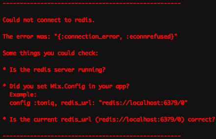

!SLIDE center First bullets
# Toniq #

A simple and reliable background job library for Elixir

!SLIDE bullets
## Who am I?

My name is Joakim Kolsjö

Ruby developer since 2008

Exploring elixir :)

!SLIDE bullets

Before we get into toniq, let's go through a bit of background

!SLIDE bullets
## Do it yourself?

Background process, easy right?

    @@@elixir
    spawn fn ->
      do_work
    end

Yes, but...

What happens when it crashes?

!SLIDE
## So what to do?

    @@@elixir
    spawn_link fn ->
      do_work
    end

Now we're getting better, this will crash the calling process too!

!SLIDE
## Using a OTP supervisor?

This could work really well. Workers are restarted when they fail.

But messages, e.g. jobs are lost when it crashes.

A building block, but not a complete solution.

!SLIDE bullets
## So I went looking for something that was:

simple to use

familiar to ruby developers

reliable and explicit about error handing

work well in limited environments like heroku 
(redis instead of mnesia or dets)

!SLIDE
## Didn't find anything suitable

Nothing lived up to my expectations.

Could be what to expect in elixir compared to ruby, 
but it's also oppurtunity to do green field development.

**github.com/akira/exq** is interesting if you want resque/sidekiq compatibility.

!SLIDE
## Introducing toniq

    @@@elixir
    defmodule LazyWorker do
      use Toniq.Worker

      def perform(sleep: 0), do: # nothing
      def perform(sleep: duration) do
        :timer.sleep duration
      end
    end

    Toniq.enqueue(LazyWorker, sleep: 1000)

No spinning up workers, persisted and run right away.

Pattern matching + erlang serialization.

!SLIDE
## Pipelines!

Using Toniq.enqueue\_to...

    @@@elixir
    def create(conn, params) do
      params
      |> extract_sleep_duration
      |> Toniq.enqueue_to(LazyWorker)

      conn |> text("ok")
    end

!SLIDE
## Concurrency

Basically unlimited by default.

One job = one erlang process.

One VM = 100k+ erlang processes.

!SLIDE
## The journey of building toniq

Very fun experience.

Learned much about OTP from "Elixir in Action"

Already pretty used to functional programming though 
intentionally working that way in ruby (recommended!).

!SLIDE
## A bit different: redis as backup and failover

Toniq runs jobs within the VM that enqueued them.

Redis is used as a backup, not as a message queue.

Takeover of orphaned jobs is done using a redis transaction. 

**Simple design to avoid complexity**

!SLIDE
## Good error messages

Making confusing error messages is easy, 
making good ones is not that much more work.

    [error] Job #19:
    Toniq.TestWorker.perform(:fail_once)
    failed with error:
    %RuntimeError{message: "failing once"}

!SLIDE
## Handling failed jobs

Easy CLI interface to handle failed jobs (which are reported to **honeybadger** or similar tools though error logging).

    @@@elixir
    heroku run iex -S mix

    iex> job = Toniq.failed_jobs |> hd
    %{id: 3, opts: [], worker: LazyWorker}

    iex> # Toniq.retry(job)
    iex> Toniq.delete(job)

    iex> Toniq.failed_jobs |>
         Enum.each &Toniq.retry/1

Admin web UI is planned, contributions welcome.

!SLIDE
## Benchmarks (quick jobs)
 

**Sidekiq** (ruby 2.2.3, 4 processes, 1000 threads): 

10 000 quick jobs, in 4.68 seconds, 2136 jobs / second 

 
 
**Toniq** (elixir 1.1.1 / erlang 1.8, 1 process):

10 000 quick jobs, in 1.8 seconds, **5500 jobs / second** (2.5x) 
         

(iMac, mid 2011, quad-core i7, 3.4ghz)

!SLIDE
## Benchmarks (slow jobs: 5 second sleep)
 

**Sidekiq** (ruby 2.2.3, 4 processes, 1000 threads): 

10 000 slow jobs, in 51 seconds,   196 jobs/second

 
 
**Toniq** (elixir 1.1.1 / erlang 1.8, 1 process):

10 000 slow jobs, in 6.8 seconds, **1470 jobs/second** (7.5x)
         

(iMac, mid 2011, quad-core i7, 3.4ghz)

!SLIDE
## Status of toniq?

Error handling works

Concurrency works

Failover works

In production use in a small internal project.

Not yet 1.0 but close.

!SLIDE
## &nbsp;

**@joakimk** | **github.com/joakimk/toniq**

contributions? admin ui, benchmarks, ...

pair on using toniq in your app?

**dev.auctionet.com** - we're hiring (ruby devs)

any questions?

thank you!
